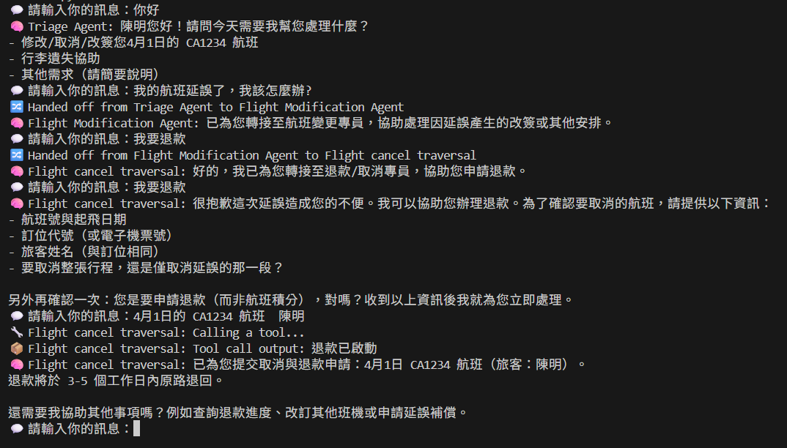

# Multi-agent 客服系統

## 專案說明
本專案為一個多代理人（Multi-Agent）智慧客服系統，模擬航空公司客戶服務流程。系統可根據使用者需求自動分派至不同專業代理人，處理如航班修改、航班取消、航班更改及行李遺失等情境，並支援自動轉接與工具呼叫，提升服務效率與體驗。

## 系統核心重點
 - **多代理人協作**：每個代理人（Agent）專責不同任務，並可根據情境自動轉接。
 - **分派機制**：透過分派代理人（Triage Agent）判斷使用者意圖，將請求導向正確代理人。
 - **工具呼叫**：代理人可呼叫特定工具（如查詢、升級、結案等）自動處理任務。
 - **上下文資訊傳遞**：每次對話皆保留完整上下文資訊，確保服務連貫性。
 - **彈性擴充**：可輕鬆新增其他代理人或工具，具備良好延展性。

## 各 Agent 說明與工具

### 1. Triage Agent（分派代理人）
- **功能**：判斷使用者是**航班修改**還是**行李遺失**。
- **轉移**：轉移請求至 `Flight Modification Agent` 或 `Lost Baggage Agent`。

### 2. Flight Modification Agent（航班修改代理人）
- **功能**：判斷使用者是要**取消**還是**更改**航班，並進行釐清。
- **轉移**：轉移請求至 `Flight Cancel Agent` 或 `Flight Change Agent`。

### 3. Flight Cancel Agent（航班取消代理人）
- **功能**：協助客戶取消航班，並處理退款或航班積分。
- **工具**：
    - `escalate_to_agent`：升級至人工客服
    - `initiate_refund`：啟動退款
    - `initiate_flight_credits`：啟動航班積分
    - `case_resolved`：結案

### 4. Flight Change Agent（航班更改代理人）
- **功能**：協助客戶更改航班，推薦新航班並處理票價差異。
- **工具**：
    - `escalate_to_agent`：升級至人工客服
    - `valid_to_change_flight`：驗證是否可更改
    - `change_flight`：執行航班更改
    - `case_resolved`：結案

### 5. Lost Baggage Agent（行李遺失代理人）
- **功能**：協助客戶查找遺失行李，並安排後續處理。
- **工具**：
    - `escalate_to_agent`：升級至人工客服
    - `initiate_baggage_search`：啟動行李查找
    - `case_resolved`：結案


## 整體流程（Flow）與資料傳遞
1. 使用者輸入訊息，系統將訊息與上下文資訊傳遞給分派代理人（Triage Agent）。
2. 分派代理人（`Triage Agent`）根據內容判斷需求，決定是否轉接至航班修改代理人（`Flight Modification Agent`）、航班取消代理人（`Flight Cancel Agent`）、航班更改代理人（`Flight Change Agent`）或行李遺失代理人（`Lost Baggage Agent`）。
3. 各專業代理人根據政策流程處理請求，必要時呼叫工具（如退款 `refund_tool`、查找行李 `baggage_lookup_tool`、升級人工客服 `escalate_tool` 等）。
4. 若代理人無法處理，或需進一步分派，則自動轉回分派代理人（`Triage Agent`）。
5. 所有對話與處理結果皆保留於對話記錄，確保資訊完整。

## 原理圖（Schematics）

```mermaid
flowchart TD
    User(使用者<br><br>User)
    TriageAgent(分派代理人<br><br>Triage Agent)
    FlightModification(航班修改代理人<br><br>Flight Modification Agent)
    FlightCancel(航班取消代理人<br><br>Flight Cancel Agent)
    FlightChange(航班更改代理人<br><br>Flight Change Agent)
    LostBaggage(行李遺失代理人<br><br>Lost Baggage Agent)

    %% 主流程
    User -->|訊息| TriageAgent
    TriageAgent -->|轉接| FlightModification
    TriageAgent -->|轉接| LostBaggage
    FlightModification -->|轉接| FlightCancel
    FlightModification -->|轉接| FlightChange
    FlightCancel -->|轉接| TriageAgent
    FlightChange -->|轉接| TriageAgent
    LostBaggage -->|轉接| TriageAgent

    subgraph cancel_tools [Tool Set&nbsp;&nbsp;&nbsp;&nbsp;&nbsp;&nbsp;&nbsp;&nbsp;&nbsp;&nbsp;&nbsp;&nbsp;&nbsp;&nbsp;&nbsp;&nbsp;&nbsp;&nbsp;&nbsp;&nbsp;&nbsp;&nbsp;&nbsp;&nbsp;&nbsp;&nbsp;&nbsp;]
        style cancel_tools fill:#333,stroke:none
        cancel_ops[initiate_refund,<br>initiate_flight_credits,<br>escalate_to_agent,<br>case_resolved]
    end
    subgraph change_tools [Tool Set&nbsp;&nbsp;&nbsp;&nbsp;&nbsp;&nbsp;&nbsp;&nbsp;&nbsp;&nbsp;&nbsp;&nbsp;&nbsp;&nbsp;&nbsp;&nbsp;&nbsp;&nbsp;&nbsp;&nbsp;&nbsp;&nbsp;&nbsp;&nbsp;&nbsp;&nbsp;&nbsp;]
        style change_tools fill:#333,stroke:none
        change_ops[valid_to_change_flight,<br>change_flight,<br>escalate_to_agent,<br>case_resolved]
    end
    subgraph baggage_tools [Tool Set&nbsp;&nbsp;&nbsp;&nbsp;&nbsp;&nbsp;&nbsp;&nbsp;&nbsp;&nbsp;&nbsp;&nbsp;&nbsp;&nbsp;&nbsp;&nbsp;&nbsp;&nbsp;&nbsp;&nbsp;&nbsp;&nbsp;&nbsp;&nbsp;&nbsp;&nbsp;&nbsp;]
        style baggage_tools fill:#333,stroke:none
        baggage_ops[initiate_baggage_search,<br>escalate_to_agent,<br>case_resolved]
    end

    FlightCancel --> cancel_ops
    FlightChange --> change_ops
    LostBaggage --> baggage_ops

```



## 如何設定並啟動

### 1. 安裝相依套件
請先安裝 Python 3.12。
進入專案目錄後，安裝必要函式庫：

```sh
pip install openai-agents==0.5.0
```
### 2. 設定環境變數
請於專案根目錄建立 `.env` 檔案，並填入你的 OpenAI API 金鑰：

```
OPENAI_API_KEY="你的金鑰"
```

### 3. 啟動系統
於終端機執行主程式：

```sh
python main.py
```

系統將進入互動模式，依序輸入訊息即可體驗多代理人客服流程。

---

## 代理人執行範例

